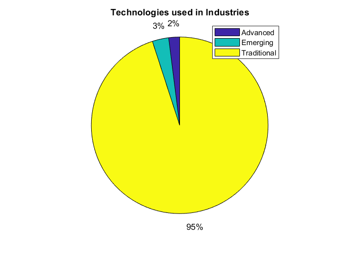
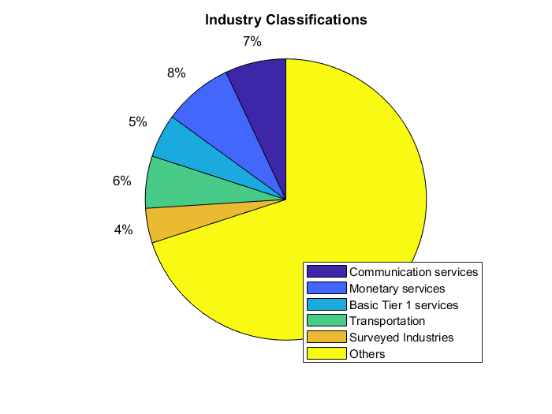
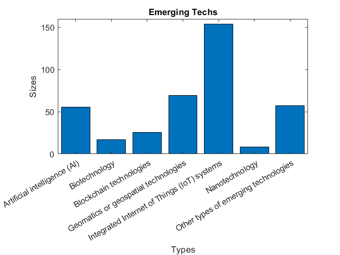
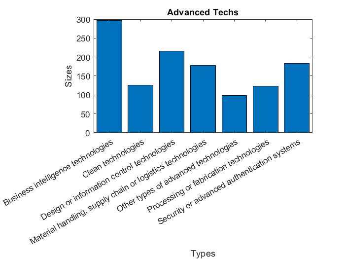
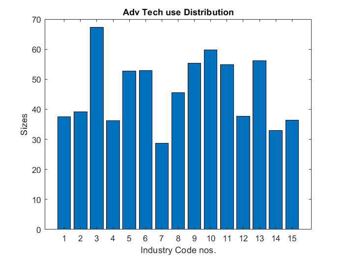
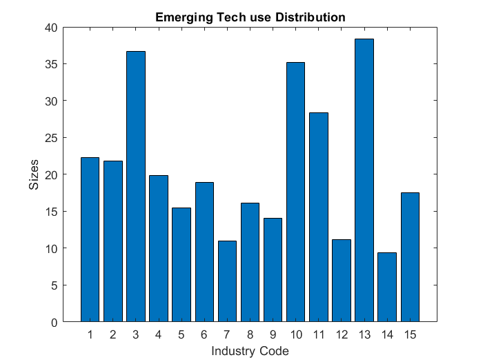
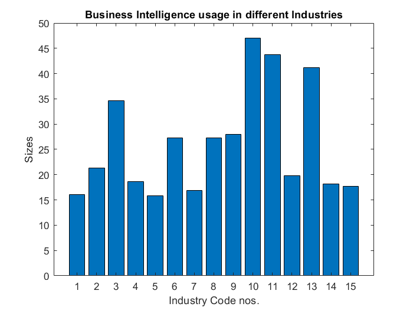
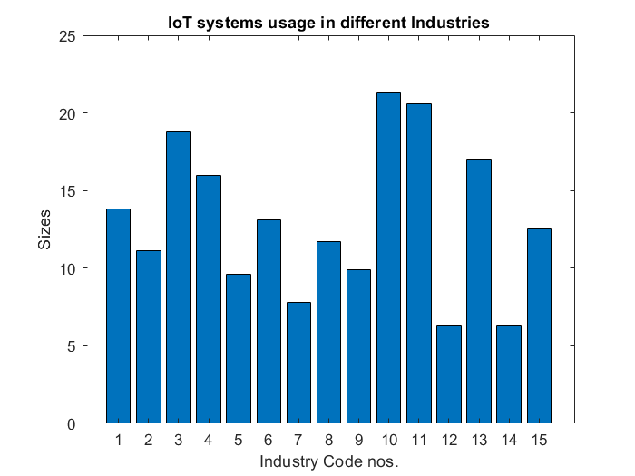
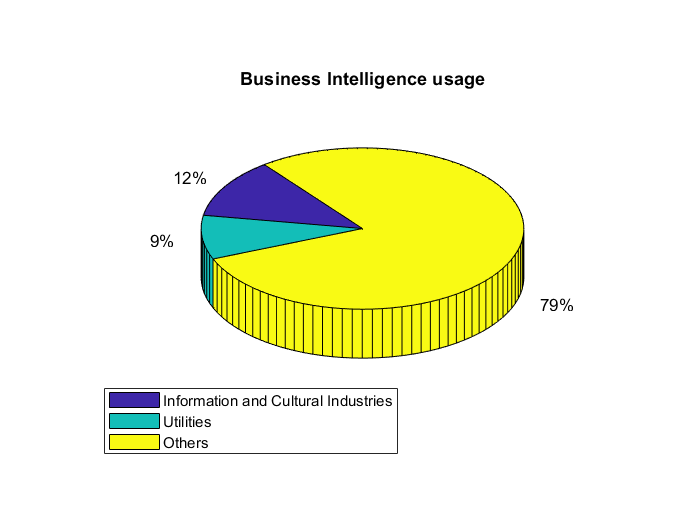
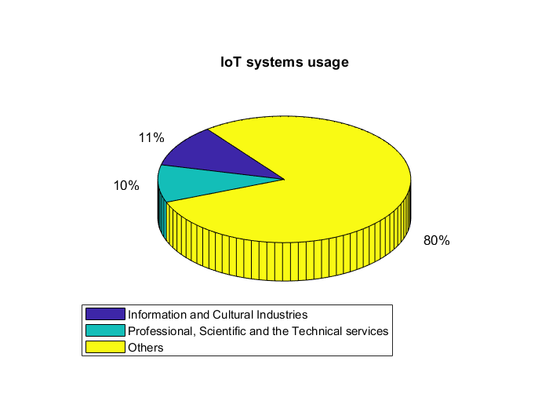

# Enterprise sizes by NAICS in Canada Report
  
# Importing and Data Processing

(We are importing our data after raw data processing in MS Excel.)

  

```matlab:Code
advTech = importfile4("advtech.csv");
advTech.totalSize = advTech.AgricultureForestryFishingAndHunting + advTech.MiningQuarryingAndOilAndGasExtraction + advTech.Utilities + advTech.Construction + advTech.Manufacturing + advTech.WholesaleTrade + advTech.RetailTrade + advTech.TransportationAndWarehousing + advTech.PostalServicesCouriersAndMessengersWarehousingAndStorage7 + advTech.InformationAndCulturalIndustries + advTech.FinanceAndInsuranceExcludingMonetaryAuthorities8;
advTech.Properties.VariableNames{1} = 'Technology'
```

| |Technology|AgricultureForestryFishingAndHunting|MiningQuarryingAndOilAndGasExtraction|Utilities|Construction|Manufacturing|WholesaleTrade|RetailTrade|TransportationAndWarehousing|PostalServicesCouriersAndMessengersWarehousingAndStorage7|InformationAndCulturalIndustries|FinanceAndInsuranceExcludingMonetaryAuthorities8|RealEstateAndRentalAndLeasing|ProfessionalScientificAndTechnicalServices|ManagementOfCompaniesAndEnterprises|AdministrativeAndSupportWasteManagementAndRemediationServices|totalSize|
|:--:|:--:|:--:|:--:|:--:|:--:|:--:|:--:|:--:|:--:|:--:|:--:|:--:|:--:|:--:|:--:|:--:|:--:|
|1|Material handling, s...|20.8000|15.6000|8.6000|12.8000|14.6000|26|9.5000|21.4000|33.3000|9.9000|4.9000|9.7000|5.6000|3.7000|4.3000|177.4000|
|2|Design or informatio...|15.5000|12.8000|28.6000|17.5000|24.6000|20.6000|8.4000|14.9000|18.6000|28.2000|26.1000|15|25.8000|10.5000|13.4000|215.8000|
|3|Processing or fabric...|14.8000|14.3000|10.1000|9.9000|35.4000|15.2000|3.6000|5.2000|5.2000|7.6000|2|4.4000|5.7000|6.5000|5|123.3000|
|4|Clean technologies|13.9000|11.6000|36.1000|10.3000|11.3000|11.6000|8.2000|10.6000|6.1000|2.2000|3.8000|11.1000|7.4000|4.9000|12.8000|125.7000|
|5|Security or advanced...|12.4000|7.9000|22.5000|8.1000|9.8000|15.1000|10.3000|13.5000|17.8000|30.9000|34.8000|12.7000|21.1000|9.7000|17.5000|183.1000|
|6|Business intelligenc...|16.1000|21.3000|34.6000|18.6000|15.8000|27.3000|16.9000|27.3000|28|47|43.7000|19.8000|41.2000|18.2000|17.7000|296.6000|
|7|Other types of advan...|4.4000|6.9000|14.7000|8|6.7000|8.1000|5.9000|8.1000|5.4000|18.4000|11.3000|9.4000|16.9000|4.5000|9.7000|97.9000|

  

```matlab:Code
emergingTech = importfile4("emertech.csv");
emergingTech.totalSize = emergingTech.AgricultureForestryFishingAndHunting + emergingTech.MiningQuarryingAndOilAndGasExtraction + emergingTech.Utilities + emergingTech.Construction + emergingTech.Manufacturing + emergingTech.WholesaleTrade + emergingTech.RetailTrade + emergingTech.TransportationAndWarehousing + emergingTech.PostalServicesCouriersAndMessengersWarehousingAndStorage7 + emergingTech.InformationAndCulturalIndustries + emergingTech.FinanceAndInsuranceExcludingMonetaryAuthorities8;
emergingTech.Properties.VariableNames{1} = 'Technology'
```

| |Technology|AgricultureForestryFishingAndHunting|MiningQuarryingAndOilAndGasExtraction|Utilities|Construction|Manufacturing|WholesaleTrade|RetailTrade|TransportationAndWarehousing|PostalServicesCouriersAndMessengersWarehousingAndStorage7|InformationAndCulturalIndustries|FinanceAndInsuranceExcludingMonetaryAuthorities8|RealEstateAndRentalAndLeasing|ProfessionalScientificAndTechnicalServices|ManagementOfCompaniesAndEnterprises|AdministrativeAndSupportWasteManagementAndRemediationServices|totalSize|
|:--:|:--:|:--:|:--:|:--:|:--:|:--:|:--:|:--:|:--:|:--:|:--:|:--:|:--:|:--:|:--:|:--:|:--:|
|1|Nanotechnology|0|0.9000|0.8000|0|1.9000|2|1.2000|0.3000|0|0.9000|0.1000|1.3000|1.9000|0|0.2000|8.1000|
|2|Biotechnology|5.4000|1.9000|2.8000|0.8000|1.4000|3|0.7000|0.5000|0|0.6000|0.1000|0.2000|4.5000|0.3000|0.9000|17.2000|
|3|Geomatics or geospat...|5.3000|11.4000|18.2000|3.8000|1.4000|3|0.1000|4.2000|2.9000|5.8000|13.1000|2.6000|10.2000|1.6000|4.7000|69.2000|
|4|Artificial intellige...|1.8000|3.7000|3.4000|0.8000|2.8000|3|2.1000|1.6000|0.6000|16.8000|19.1000|2.1000|11.5000|3.2000|4.7000|55.7000|
|5|Integrated Internet ...|13.8000|11.1000|18.8000|16|9.6000|13.1000|7.8000|11.7000|9.9000|21.3000|20.6000|6.3000|17|6.3000|12.5000|153.7000|
|6|Blockchain technolog...|0|0.6000|2.5000|0|0.5000|2.2000|0.6000|1|0.6000|4.3000|13.4000|0.9000|2.7000|0|1.5000|25.7000|
|7|Other types of emerg...|2.7000|4.3000|12.2000|3.7000|3.4000|4.9000|2.3000|2.5000|5.4000|11|4.7000|3|12.2000|1.9000|5|57.1000|

  

```matlab:Code
contributionsByTech = importfile11("biggerTechContributions2.csv")
```

| |Techs|PercentageContribution|
|:--:|:--:|:--:|
|1|Advanced technology ...|2|
|2|Emerging technology ...|3|
|3|Traditional technolo...|95|

  

```matlab:Code
contributionsByInd = importfile8("biggerIndContributions3.csv")
```

| |Industries|PercentageContribution|
|:--:|:--:|:--:|
|1|Postal services, cou...|7|
|2|Finance and insuranc...|8|
|3|Total selected servi...|5|
|4|All transportation|6|
|5|Total all surveyed i...|4|
|6|others|70|

  

```matlab:Code
distribution = importfile12("distribution.csv");
distribution.IndustryCode = categorical(["CATEGORY 1";"CATEGORY 2"; "CATEGORY 3";"CATEGORY 4";"CATEGORY 5";"CATEGORY 6";"CATEGORY 7";"CATEGORY 8";"CATEGORY 9";"CATEGORY 10";"CATEGORY 11";"CATEGORY 12";"CATEGORY 13";"CATEGORY 14";"CATEGORY 15"])
```

| |Industries|AdvancedTechnologyUse|EmergingTechnologyUse|IndustryCode|
|:--:|:--:|:--:|:--:|:--:|
|1|Agriculture, forestr...|37.6000|22.3000|CATEGORY 1|
|2|Mining, quarrying, a...|39.2000|21.8000|CATEGORY 2|
|3|Utilities|67.3000|36.7000|CATEGORY 3|
|4|Construction|36.3000|19.9000|CATEGORY 4|
|5|Manufacturing|52.8000|15.5000|CATEGORY 5|
|6|Wholesale trade|52.9000|18.9000|CATEGORY 6|
|7|Retail trade|28.7000|11|CATEGORY 7|
|8|Transportation and w...|45.6000|16.1000|CATEGORY 8|
|9|Postal services, cou...|55.4000|14.1000|CATEGORY 9|
|10|Information and cult...|59.8000|35.2000|CATEGORY 10|
|11|Finance and insuranc...|54.8000|28.4000|CATEGORY 11|
|12|Real estate and rent...|37.7000|11.2000|CATEGORY 12|
|13|Professional, scient...|56.1000|38.4000|CATEGORY 13|
|14|Management of compan...|33|9.4000|CATEGORY 14|

# Visualizations
  
## Pie Chart of 
## *the Technologies* used in Industries

```matlab:Code
pie(contributionsByTech.PercentageContribution)
legend('Advanced','Emerging','Traditional')
title('Technologies used in Industries')
```



Contribution of *Advanced* and *Emerging* technologies in industries is still very less but *considerably visible*.

  
## Pie Chart of 
## *Industry* Classifications

```matlab:Code
pie(contributionsByInd.PercentageContribution)
legend('Communication services','Monetary services','Basic Tier 1 services','Transportation','Surveyed Industries','Others','Location',"best")
title('Industry Classifications')
```



These five sectors have a fair hold in the stream of multi sector enterprices with max being in the *finance* sector.

  
## Bar Chart of 
## *Emerging Technology* types and their hold of influence in Application

or: Which is the maximum applied Emerging Technology?

This chart gives us an idea about what all are the Emerging Technologies and which technology is currently in maximum use or minimum use.

  

```matlab:Code
bar(emergingTech.Technology,emergingTech.totalSize,'DisplayName','emergingTech.totalSize')
title('Emerging Techs')
xlabel('Types')
ylabel('Sizes')
```



  

We see that in the emerging technologies* IoT sytems *has maximum influence followed by *Geomantics* and *AI*.

  
## Bar Chart of 
## *Advanced Technology* types and their hold of influence in Application

or: Which is the maximum applied Advanced Technology?

This chart gives us an idea about what all technologies come under Advanced Technologies and which technology is currently in maximum use or minimum use.

  

```matlab:Code
bar(advTech.Technology,advTech.totalSize,'DisplayName','advTech.totalSize')
title('Advanced Techs')
xlabel('Types')
ylabel('Sizes')
```



  

We see in this chart that in the advanced technologies* Business Intelligence Tech *has maximum influence followed by *IT*.

  
## Bar Chart of 
## *Advanced Tech use distribution* in Industries 

or: Which Industry is in lead in using the Advanced technologies?

This chart would give us an idea about the use of Advanced technologies overall in industries. (We had to plot by the industry codes as the names were too big! A reference is attached later for ease.)

  

```matlab:Code
bar(distribution.AdvancedTechnologyUse)
%bar(distribution.IndustryCode,distribution.AdvancedTechnologyUse,'DisplayName','distribution.AdvancedTechnologyUse')
title('Adv Tech use Distribution')
xlabel('Industry Code nos.')
ylabel('Sizes')
```



  

Hence we see that category 3 has the highest use i.e., the *Utilities* sector. With categories 10 and 13 having fairly high shares following utilities.

  

For reference here is the list:

```matlab:Code
indCodeTable = table(distribution.Industries)
```

| |Var1|
|:--:|:--:|
|1|Agriculture, forestr...|
|2|Mining, quarrying, a...|
|3|Utilities|
|4|Construction|
|5|Manufacturing|
|6|Wholesale trade|
|7|Retail trade|
|8|Transportation and w...|
|9|Postal services, cou...|
|10|Information and cult...|
|11|Finance and insuranc...|
|12|Real estate and rent...|
|13|Professional, scient...|
|14|Management of compan...|

  
## Bar Chart of 
## *Emerging Tech use distribution* in Industries 

or: Which Industry is in lead of using the Emerging Technologies?

Similarly, this chart would give us an idea about which industries use how much of the available emerging technologies. (Please refer the Industry codes table for ease.)

  

```matlab:Code
bar(distribution.EmergingTechnologyUse)
title('Emerging Tech use Distribution')
xlabel('Industry Code')
ylabel('Sizes')
```



  

Hence here we see that Category 13 i.e., the Professional, Scientific and the Technical services lead in using the Emerging Technologies.

  

For reference here is the list:

```matlab:Code
indCodeTable = table(distribution.Industries)
```

| |Var1|
|:--:|:--:|
|1|Agriculture, forestr...|
|2|Mining, quarrying, a...|
|3|Utilities|
|4|Construction|
|5|Manufacturing|
|6|Wholesale trade|
|7|Retail trade|
|8|Transportation and w...|
|9|Postal services, cou...|
|10|Information and cult...|
|11|Finance and insuranc...|
|12|Real estate and rent...|
|13|Professional, scient...|
|14|Management of compan...|

  
# Inferences and Verifications
  

Now that we have answers to questions like:  

**What are the bigger Industry sectors?  ***Finance > Communication > Transportation > Tier 1 services  > Industries. ***What are the contribution pecentages of Advanced and Emerging Tech in overall Tech use? ***2% and 3% respectively. ***Which particular Advanced or Emerging Tech is used the most? ***Business Intelligence and IoT Systems respectively. ***Which Industry uses the most of Advanced or Emerging Tech? ***Utilities sector and Professional, Scientific and the Technical services sector respectively.*

  

We can further focus on Utilities sector , the Professional, Scientific and the Technical services sector, the Business Intelligence Tech and the IoT Systems Tech.

  

Let's draw out the information of Business Intelligence Systems and IoT systems.

```matlab:Code
businessIntelligence = advTech(advTech.Technology == 'Business intelligence technologies',:);
businessIntelligence = table2cell(businessIntelligence);
businessIntelligence = transpose(businessIntelligence);
bar(cell2mat(businessIntelligence(2:16,1)))
xlabel('Industry Code nos.')
ylabel('Sizes')
title('Business Intelligence usage in different Industries')
```



  

```matlab:Code
IoTsys = emergingTech(emergingTech.Technology == 'Integrated Internet of Things (IoT) systems',:);
IoTsys = table2cell(IoTsys);
IoTsys = transpose(IoTsys);
bar(cell2mat(IoTsys(2:16,1)))
xlabel('Industry Code nos.')
ylabel('Sizes')
title('IoT systems usage in different Industries')
```



  

From the above graphs we can say that Business Intelligence and IoT systems Technology both are used the most in *Information and Cultural Industries* (CATEGORY 10). 

Also we can note that *Utilities*, i.e., CATEGORY 3 has a fair share of usage with *size 34.6 with the highest being size 47* (in Information and Cultural Industries obviously) in the Advanced Tech usage of Business Intelligence. Now, in IoT systems usage also we can note that *Professional, Scientific and the Technical services* sector CATEGORY 13* *has a fairly high usage *size i.e., 17 with the highest in it being size 21.3*. So here our past inferences seem to match the evidences!

  

Let's represent these information in pie chart now:

```matlab:Code
ab = (cell2mat(businessIntelligence(2:16,1)));
c = ab(10,1); d = ab(3,1); e = sum([transpose(ab(1:2)),transpose(ab(4:9)),transpose(ab(11:15))]);
pie3([c,d,e])
legend('Information and Cultural Industries','Utilities','Others','Location',"southwest")
title('Business Intelligence usage')
```



```matlab:Code
fg = (cell2mat(IoTsys(2:16,1)));
h = fg(10,1); i = fg(3,1); j = sum([transpose(fg(1:2)),transpose(fg(4:9)),transpose(fg(11:15))]);
pie3([h,i,j])
legend('Information and Cultural Industries','Professional, Scientific and the Technical services','Others','Location',"southwest")
title('IoT systems usage')
```



And here again we can see our past inferences match the evidences from the plots.

# Conclusions
  

**What are the bigger Industry sectors?  ***Finance > Communication > Transportation > Tier 1 services  > Industries. ***What are the contribution pecentages of Advanced and Emerging Tech in overall Tech use? ***2% and 3% respectively. ***Which particular Advanced or Emerging Tech is used the most? ***Business Intelligence and IoT Systems respectively. ***Which Industry uses the most of Advanced or Emerging Tech? ***Utilities sector and Professional, Scientific and the Technical services sector respectively.*

  

Yes indeed they were correct.* And additionally we conclude that,*

*Business Intelligence *(Advanced Tech) and *IoT systems* (Emerging Tech) both are used the most in ***Information and Cultural Industries***, with a respective size of 47 and 21.3. Which is quite a logical outcome! And Industries like *Utilities* and *Professional, Scientific and the Technical services *also have a fair contribution to the usage of these two Techs being the most to use the Advanced and Emerging Techs respectively.

  

*Hence it is seen that the newest of the technologies have started to come into use visibly in the surveyed industries of Canada but have nowhere yet replaced the traditional methods. There is still a lot of area to be covered and conquered by the newest of the Techs.*

  
# Thank You!

***
*Generated from dataAnalysis.mlx with [Live Script to Markdown Converter](https://github.com/roslovets/Live-Script-to-Markdown-Converter)*
